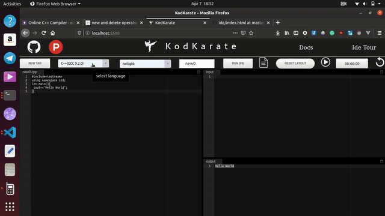
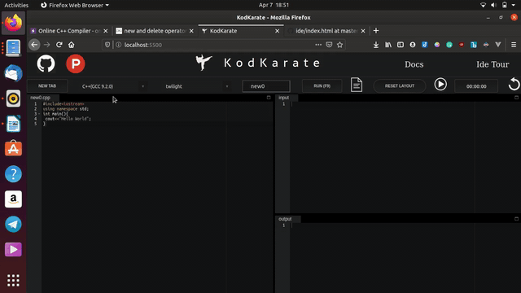
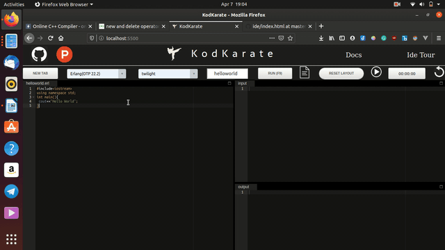
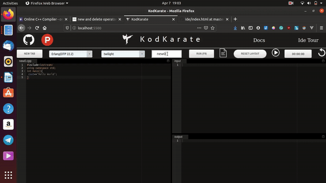
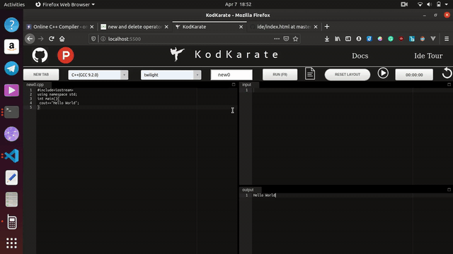
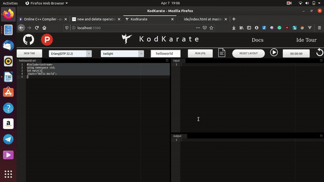

# Welcome To KodKarate

## Introduction

KodKarate is an open source IDE powered by _Judge Api_ with support for 21 programming languages and 17 themes.

The documentation comes in two languages: **English** and **Hindi**

### Languages Supported:-

| Language                   |
| -------------------------- |
| C++(GCC 9.2.0)             |
| C(GCC 9.2.0)               |
| Java(OpenJDK 13.0.1)       |
| Python(2.7.17)             |
| Python(3.8.1)              |
| Rust(1.40.0)               |
| TypeScript(3.7.4)          |
| Prolog(GNU Prolog 1.4.5)   |
| Php(7.4.1)                 |
| Assembly(Nasm 2.14.02)     |
| Common lisp (SBCL 2.0.0)0) |
| D(DMD 2.089.1)             |
| Elixir(1.9.4)              |
| Erlang(OTP 22.2)           |
| Fortran(9.2.0)             |
| GO                         |
| Haskell(GHC 8.8.1)         |
| Lua(5.3.5)                 |
| Nodejs(12.14.0)            |
| OCaml(4.09.0)              |
| Octave(5.1.0)              |

## Features

### Multi Tab Support

Kodkarate supports a multitab development environment in which it is possible to work on multiple file at the same time.

### Code Download Support

Kodkarate comes with the ability to allow you to download a file in the respective programming language extension so that you can have a valid copy of your code.

### Snippets and Autocomplete

Kodkarate supports snippets and autocomplete in 19 programming languages and it acts as a time saver for you

### Resizable Layout

The editor comes with a
completely resizable layout and the whole editor is responsive.

### Track Your Time

The platform comes with a support for a timer so that you can track the time taken by you to solve a praticular problem

### Keyboard Shortcuts

Normal keyboard shortcuts are supported, like **ctrl+z** for undo and you can searching with **ctrl+f**

Program can be run using the **f9** key.

### Custom Filenames

The platform allows you to have custom file name so that you can download the files by the name you want

### Optimized Code

The platform has been coded by taking in consideration of the javascript engine internals so that it can deliever optimum performance.

### Countribution

The project is open source and currently in beta and needs countribution in term to increase the product quality

You can countribute in the following areas:-

- Documentation
- Source Code
- User interface
- Mobile version development

The promotion of the platforms among your peers can be of great help to the project and will help the project by making it available to a bigger audience.
